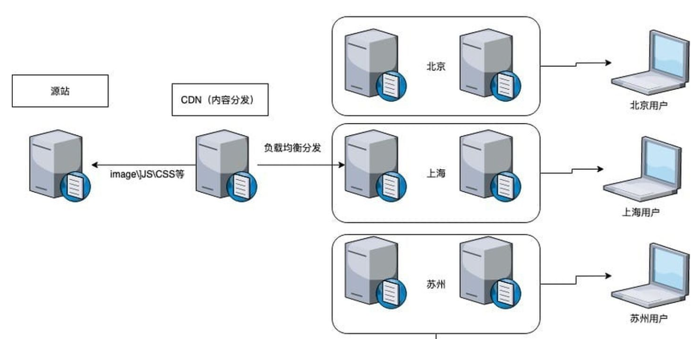

# HTTP头信息  


> 场景：服务器返回**304状态码**

例如：对域名发起一个无参数GET请求

```json
//首次请求的结果
HTTP/1.1 200 OK
response header {
    .........
    Server: Server-Name,
    Last-Modified: Wed, 12 May 2021 06:51:41 GMT,  //用来对比是否进行了修改
    ETag: W/"609b7afd-19e8",      //对比静态资源是否改变
    X-Via: 1.1 hzsx163:5 (Cdn Cache Server V2.0), 1.1 PS-WNZ-01uZo114:13 (Cdn Cache Server V2.0),   //CDN缓存服务器
 	.........
}
```

```json
//浏览器有了缓存信息后再次请求
304 Not Modified
response header {
    Server: Server-Name
    Last-Modified: Wed, 12 May 2021 06:51:41 GMT
    X-Via: 1.1 anxian77:8 (Cdn Cache Server V2.0), 1.1 xfzh12:6 (Cdn Cache Server V2.0)
    ETag: W/"609b7afd-c2,
9f9"
}

request header {
    Cache-Control: max-age=0,
    If-None-Match: W/"609b7afd-19e8"
    If-Modified-Since: Wed, 12 May 2021 06:51:41 GMT
}
```
## 一、Last-Modified

> 资源修改时间

客户端在请求的时候，发现自己缓存的文件（磁盘）有` If Modified Since`信息 ，就会包含 `If Modified Since `，代表的是**服务器静态资源上一次被修改的时间**。服务端只要判断这个时间和当前请求的文件的修改时间就可以确定是返回 304 还是 200 。如果是304，则在磁盘中加载资源，否则发起请求。这样可以减少重复请求，降低带宽消耗

> 动态页面无法自动进行缓存更新

对于静态文件，例如：CSS、图片，服务器会自动完成` Last Modified` 和` If Modified Since `的比较，完成缓存或者更新。***但是对于动态页面，就是动态产生的页面，往往没有包含 `Last Modified `信息，这样浏览器、网关等都不会做缓存，也就是在每次请求的时候都完成一个 200 的请求。***

这时候利用服务器传回的`ETag`信息进行比较。  

## 二、ETag和If-Match

> ETag

Apache 1.3.22`ETag`默认采用inode、size、last-modified time (mtime）三个信息按某种加密形式组合生成，是HTTP1.1新出的响应头标签。（inode，索引节点，它用来存放档案及目录的基本信息，包含时间、档名、使用者及群组等）。

另一方面，如果内容发生了变化，`ETag`有助于防止资源的同时更新互相覆盖（“空中冲突”）。

> `ETag`具有两种生成方式

```json
ETag: "33a64df551425fcc55e4d42a148795d9f25f89d4"     //强验证器生成    理想但计算开销大，难高效
ETag: W/"0815"										 //弱验证器生成  
```

> 配合`If-Match`标签使用

如果请求服务器传回了`ETag`，则在下次请求时，会从缓村信息中拿`ETag`写入请求头的`If-Match`信息中，服务器比较`ETag`和`If-Match`是否一致判断资源是否更新。

> ETag存在的问题  

漏洞编号：CVE-2003-1418 发布于2003年，针对版本1.3.22–1.3.27。

Apache HTTP服务器可能被远程攻击者获取敏感信息。如果将服务器配置为使用FileETag指令，则远程攻击者可以从ETag头获取文件inode编号（i-numbers），并在Apache HTTP服务器生成MIME消息边界时获取子进程的PIDs。然后，攻击者可以使用此信息对受影响的服务器发起进一步的攻击。

[IBM 关于该漏洞的公示](https://exchange.xforce.ibmcloud.com/vulnerabilities/11438)

## 三、Cache-Control  

​		服务器在Response Headers里**设置Cache-Control或Expires**头信息，可以指定该资源缓存可用时常，这样可以跳过条件请求直接获取本地缓存。

```json
Cache:
	{
    	Cache-Control:max-age=1000 //设置缓存可用时常
	}
```

> **请求中使用Cache-Control 时，它可选的值有**  

|      字段名       | 说明                                                    |
| :---------------: | :------------------------------------------------------ |
|     no-cache      | 告诉五服务器（代理）不使用缓存                          |
|     no-store      | 所有内容都不会保存到缓存或临时文件                      |
|  max-age=seconds  | 告诉服务器希望接收一个存在时间不大于seconds时间内的资源 |
| max-stale=seconds | 告诉服务器希望接收一个超过seconds时间的资源             |
| min-fresh=seconds | 告诉服务器希望接收小于seconds时间内被更新过的资源       |
|   no-transform    | 希望获得的实体数据没有被转化，如压缩                    |
|  only-if-cached   | 告诉服务器希望获取缓存内容                              |
|  cache-extension  | 自定义扩展值                                            |

> **响应中使用Cache-Control 时，它可选的值有：**  

|     字段名称     |                             说明                             |
| :--------------: | :----------------------------------------------------------: |
|      public      |                    任何情况下都要缓存资源                    |
|     Private      | 返回报文中全部或部分（指定了field-name则为field-name字段的数据）仅开放给某些用户做缓存使用，其他用户不可使用 |
|     no-cache     |              不直接使用缓存，要求服务器发起请求              |
| must-revalidate  | 当前资源一定是香园服务器发去验证请求的，若请求失败会返回504  |
| proxy-revalidate |     与must-revalidate类似，但仅能应用与共享缓存，如代理      |
| s-maxage=seconds |              同max-age但引用与共享缓存，如代理               |

## 四、Server  

`server`字段表示显示服务器的安装信息，如nginx、apache等  

nginx服务器修改掉隐藏信息，需要修改`ngx_http_header_filter_module.c`文件

```c
内容：
static char ngx_http_server_string[] = "Server: nginx" CRLF;
static char ngx_http_server_full_string[] = "Server: " NGINX_VER CRLF;
 
更改为：
static char ngx_http_server_string[] = "Server: X-Web" CRLF;
static char ngx_http_server_full_string[] = "Server:X-Web " CRLF;
```

重新编译c文件后再运行服务器。

可以是的response header中的server字段显示显示为**x-web**。

## 五、Via  
> CDN Cache Server  
CDN的全称Content Delivery Network，即内容分发网络。其基本思路是尽可能避开互联网上有可能影响数据传输速度和稳定性的瓶颈和环节，使内容传输的更快，更稳定。CDN系统能够实时地根据网络流量和各节点的连接，负债情况以及到用户的距离和响应时间等综合信息将用户的请求重新导向离用户最近的服务节点上。  




```json
X-Via: 1.1 hzsx163:5 (Cdn Cache Server V2.0), 1.1 PS-WNZ-01uZo114:13 (Cdn Cache Server V2.0)
```

## 六、 Remote Address  

表示发出请求的远程主机的IP地址，`Remote Address`代表客户端的IP，但它的值不是由客户端提供的，***而是服务端根据客户端的IP指定的***.

当不使用代理时：web的服务器（nginx、apache）会把`Remote Address`设成客户端机器的IP。

使用代理时：浏览器先访问代理，再由代理转发到这个网站，web服务器就会把`Remote Address`设为代理机器的IP。对客户端IP信息有一定的隐藏性。

`Remote Address`一般用来进行三次握手连接，**无法伪造**，如果伪造，则三次握手会失败。  

