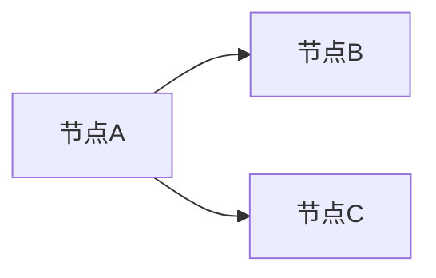
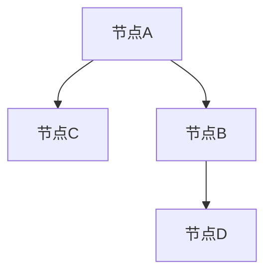
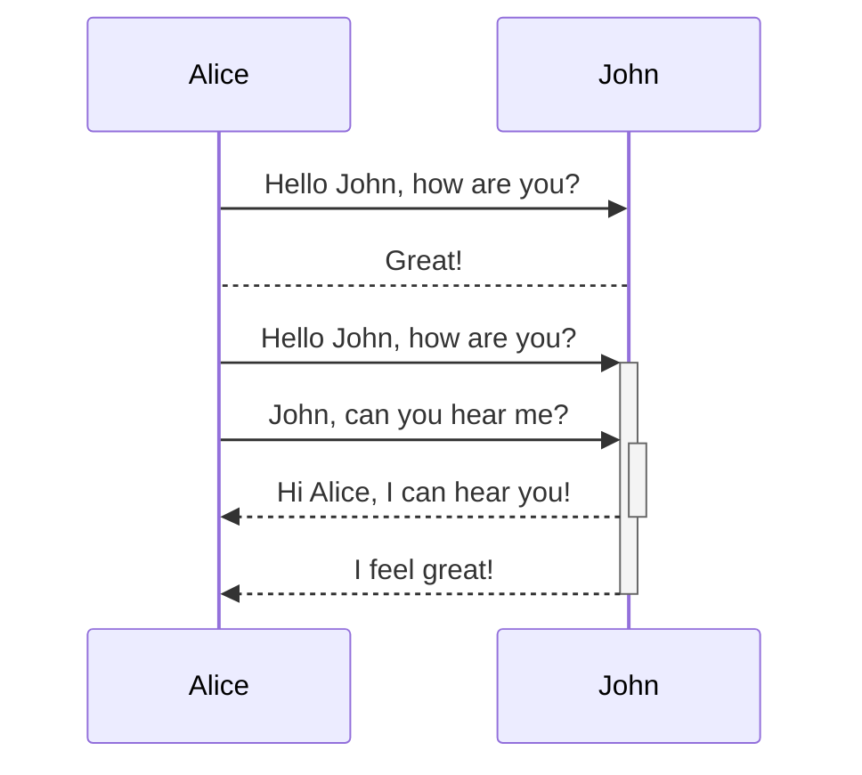
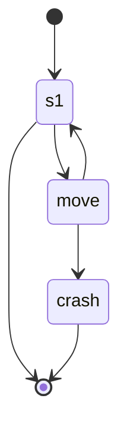
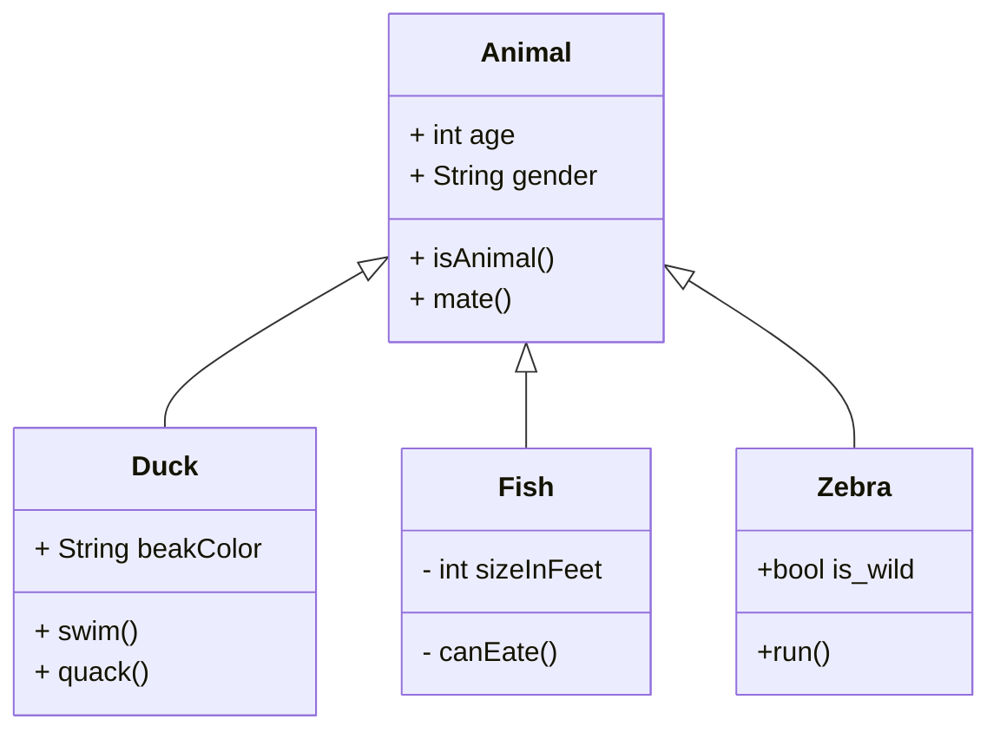
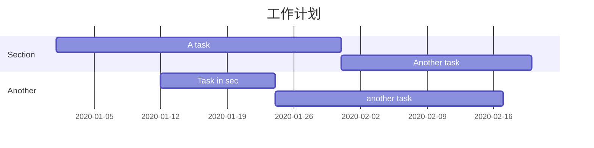

mermaid，一种类似于markdown的脚本语言，通过 javascript 将文字转化成图片，

支持绘制非常多种类的图，常见的有时序图、流程图、类图、甘特图等

# 1. 流程图（Flow Chart）-graph

## 1.1 横向思维导图（横向流程图）



## 1.2. 竖向思维导图（竖向流程图）



# 2. 时序图（Sequence Diagram）- sequenceDiagram

->> ：实线箭头

-->>：虚线



# 3. 状态图（State Diagram）- stateDiagram

[*] —— 表示开始或者结束，如在箭头右边则表示结束



# 4. 类图（class Diagram）- classDiagram

<|-- 表示继承

\+ 表示 public

\- 表示 private




# 5. 甘特图

项目的计划排期

```tex
gantt
	title 工作计划
	dateFormat YYYY-MM-DD
	section Section
	A task	:a1, 2020-01-01, 30d
	Another task	:after a1 , 20d
	section Another
	Task in sec	:2020-01-12	, 12d
	another task	:24d
```



# 6. 饼图（pie）


