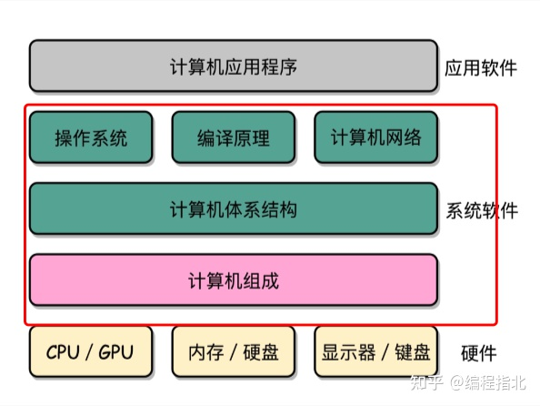

领域驱动设计

领域驱动模型

VO、DTO、DO、PO

VO（View Object）：视图对象，用于展示层，把某个指定页面（或组件）的所有数据封装起来

DTO（Data Transfer Object）：数据传输对象，展示层和服务层之间的数据传输对象

DO（Domain Object）：领域对象：从现实世界抽象出来的有形或无形的业务实体

PO（Persistent Object）：持久化对象，跟持久层（通常是关系型数据库）的数据结构形成一一对应的映射关系，如果持久层是关系型数据库，那么数据表中的每个字段（或若干个）就对应PO的一个（或若干个）属性。

CPU/GPU、内存/硬盘、显示器/键盘	硬件

计算机组成

计算机体系结构																系统软件

操作系统、编译原理、计算机网络

计算机应用程序——应用软件

