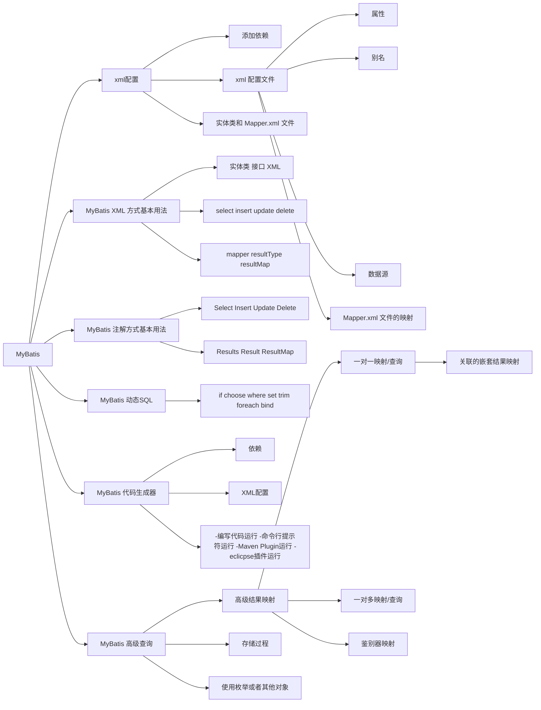

```mermaid
graph LR
A[MyBatis]-->B[xml配置]
A-->C[MyBatis XML 方式基本用法]
A-->D[MyBatis 注解方式基本用法]
A-->E[MyBatis 动态SQL]
A-->F[MyBatis 代码生成器]
A --> G[MyBatis 高级查询]

B-->B1[添加依赖]
B-->B2[xml 配置文件]
B-->B3[实体类和 Mapper.xml 文件]
B2 --> B21[属性]
B2 --> B22[别名]
B2 --> B23[数据源]
B2 --> B24[Mapper.xml 文件的映射]

C --> C1[实体类 接口 XML]
C --> C2[select insert update delete]
C --> C3[mapper resultType resultMap ]

D --> D1[Select Insert Update Delete]
D --> D2[Results Result ResultMap]

E --> E1[if choose where set trim foreach bind]

F --> F1[依赖]
F --> F2[XML配置]
F --> F3[-编写代码运行 -命令行提示符运行 -Maven Plugin运行 -eclicpse插件运行]

G --> G1[高级结果映射]
G --> G2[存储过程]
G --> G3[使用枚举或者其他对象]

G1 --> G11[一对一映射/查询]
G1 --> G12[一对多映射/查询]
G1 --> G13[鉴别器映射]

G11 --> G111[关联的嵌套结果映射]

```

