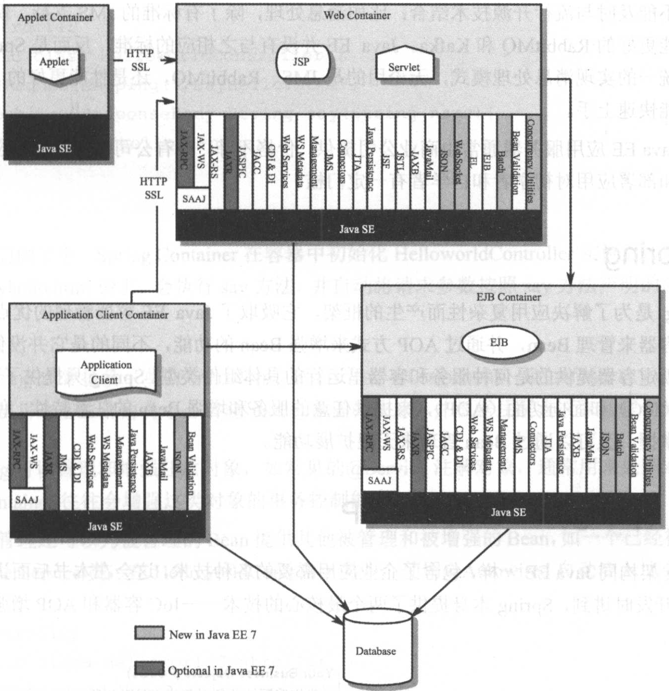

# Java EE

互联网 分布式应用、互联网应用

个人计算机、高端工作站、服务器 

企业应用、互联网应用、分布式引用：**请求-响应**

Java —— RMI 远程方法调用 —— Java EE 			分布式应用

企业应用或者互联网应用 总有以下**功能需求**， Java EE 有相应的规范实现与之对应：

+ Web 支持：企业应用、互联网应用越来越多的是基于 B/S 的结构
  + Servlet 规范、Web 容器、Servlet 组件，JSP&JSTL 处理动态页面
+ 事务支持：
  + 事务管理器，支持管理事务，如单一数据库、多个数据库，以及数据库和其他资源的事务协作等。
  + JTA 事务API 和 JTS 事务服务规范
  + 分布式事务管理，管理多个数据库或者支持事务的资源
+ 消息服务：企业各个系统、系统模块之间通过消息进行并步交互
  + JMS 服务，用于系统间可靠的消息 交互
+ 数据库持久层：
  + Java EE 先有 EJB 规范，后来又提出了更有实际操作性的 JPA，这些都是企业访问数据库常用的方法
+ Container：提供了 WebContainer，用于实现 Servlet，以及 EJB Container，实现 EJB，Container 用于管理这些组件，并提供组件需要的服务，比如 JTS、JMS

其他技术还包括如下所述的内容：

+ JWS：分布式系统交互的一种方式，是 Java 实现的一种 WebService
+ JAX-RS：通过 REST 进行交互
+ JNDI：查找服务和对象的接口，如查找一个配置好的数据源
+ JAXP/JAXB：XML 流行的时候，解析和绑定 Java Bean 的XML 工具
+ JAX-RPC：分布式系统交互的一种方式，通过 RPC 方式调用
+ JACC：安全认证

+ Java EE Application Server：提供了上述所有服务的 Web 服务器，
  + Tomcat、Resin，只能算是 Java EE Web 服务器
  + JBoss、webLogic 称为应用服务器

Java EE 提供了企业应用技术的实现规范，简化了企业应用 和 Web 开发

Java EE 缺点：

+ 过于复杂：复杂的架构，复杂的开发方式和部署方式
+ 追求分布式
+ 不能及时与流行开源技术结合
+ Java EE 应用服务器通常由商业公司提供：贵，上手、部署难

# Spring

解决应用复杂性，提供容器管理，核心：IOC、AOP

Spring缺点：

+ 使用门槛升高，要入门时间长
+ 对过时技术兼容，使用复杂度升高
+ XML配置不再流行
+ 集成第三方工具，兼容性考虑
+ 系统启动慢，不具备热部署功能，完全依赖 虚拟机或者 Web服务器的热部署

# Spring Boot

+ 简化 Spring 配置，约定大于配置
+ Starter 提供 系统级服务
+ 内置的 Tomcat 或者 Jetty 容器
+ 通过依赖的 jar 包管理、自动装配技术，容易支持与其他技术体系、工具集成
+ 支持热加载

