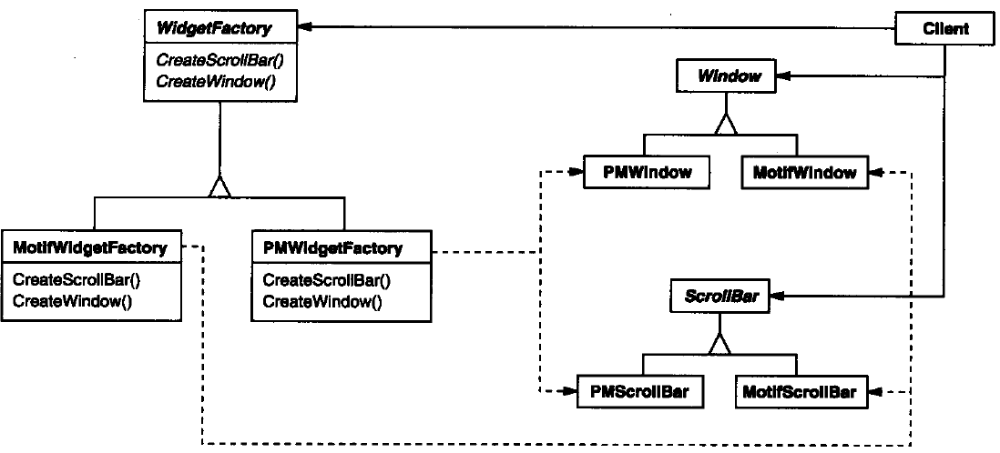
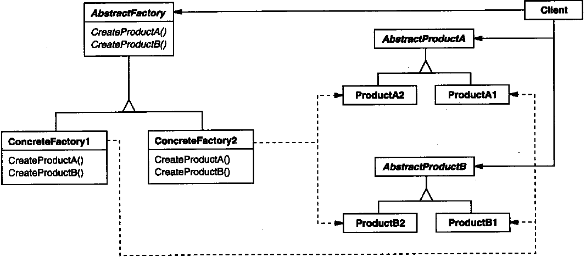

[TOC]

# 抽象工厂模式（Abstract Factory）-对象创建型模式

## 意图

**提供一个创建一系列相关或相互依赖对象的接口，而无需指定它们具体的类**


抽象工厂模式是所有形态的工厂模式中最为抽象和最具一般性的一种形态。抽象工厂模式是指当有多个抽象角色时，使用的一种工厂模式。抽象工厂模式可以向客户端提供一个接口，使客户端在不必指定产品的具体的情况下，创建多个产品族中的产品对象。


## 别名

**Kit**

## 动机

不同视感风格（为诸如滚动条、窗口、按钮等用户界面“窗口组件”定义不同的外观和行为），可移植性

一个应用不应该为一个特定的视感外观硬编码它的窗口组件，如果实例化特定视感风格的窗口组件类，后续将很难改变视感风格

为解决这个问题，定义一个**抽象的 WidgetFactory 类**，这个类声明了一个用来创建每一类基本窗口组件的接口。

每一类窗口组件都有一个抽象类，而**具体子类**则实现了窗口组件的特定视感风格

对于每一个抽象窗口组件类，WidgetFactory 接口都有一个返回新窗口组件对象的操作。通过调用这些操作以获得窗口组件实例，但是并不用了解正在使用的是哪一些具体类。



客户仅与**抽象类定义的接口**交互，而不使用**特定的具体类的接口**。

如，客户仅与抽象类定义的接口交互，而不使用特定的具体类的接口


## 适用性

使用 Abstract Factory 模式的情况：

+ 一个系统要独立于它的产品的创建、组合和表示时；—— 比如 JWT  和 swing 创建不同操作系统的视窗组件
+ 一个系统要由多个产品系列中的一个来配置时；
+ 当你要强调一系列相关的产品对象的设计以便进行联合使用时；
+ 当你提供一个产品类库，而只想显示它们的接口而不是实现时。


## 结构




## 参与者

+ AbstractFactory（WidgetFactory）—— **抽象工厂**
  + —— 声明一个创建抽象产品对象的操作接口
+ ConcreteFactory（MotifWidgetFactory，PMWidgetFactory）—— **具体工厂**
  + —— 实现创建具体产品对象的操作
+ AbstractProduct（Windows，ScrollBar）—— **抽象产品**
  + —— 为一类产品对象声明一个接口
+ ConcreteProduct（MotifWindow，MotifScrollBar）—— **具体产品**
  + —— 定义一个将被相应的具体工厂创建的产品对象
  + —— 实现 AbstractProduct 接口
+ Client
  + 仅使用由 AbstractFactory 和 AbstractProduct 类声明的接口


A 工厂生产 P1、P2 产品

B 工厂生产P1‘、P2’产品


## 模式的扩展

抽象工厂模式的扩展有一定的“开闭原则”倾斜性：

+ 当增加一个新的产品族时，只需要增加一个新的具体工厂，不需要修改原代码，满足开闭原则；
+ 当产品族中需要增加一个新种类的产品时，则所有的工厂类都需要进行修改，不满足开闭原则。


# 抽象工厂在Java源码中的应用

```java
public interface Connection {
    //提供一个执行对象
    Statement createStatement() throws SQLException;
    //提供一个支持预编译的执行对象
    PreparedStatement prepareStatement(String sql) throws SQLException;
    //提供一个支持存储过程的执行对象
    CallableStatement prepareCall(String sql) throws SQLException;
}

public class Driver extends NonRegisteringDriver implements java.sql.Driver {
    //注册DriverManager
    static {
        try {
            java.sql.DriverManager.registerDriver(new Driver());
        } catch (SQLException E) {
            throw new RuntimeException("Can't register driver!");
        }
    }
}

public class DriverManager {
    // 注册的JDBC驱动程序列表
    private final static CopyOnWriteArrayList<DriverInfo> registeredDrivers = new CopyOnWriteArrayList<>();
    .... //省略代码
}
```

Connection 是一个经典的抽象工厂模式，Statement、PreparedStatement、CallableStatement 是 Connection 这个抽象工厂提供的三个抽象产品。

Driver 起到 **Client** 的作用，只需要把 Driver 注册进 DriverManager，就可以生成需要的 Connection。每次操作数据库只需要使用 Java 提供的这套接口就可以，不需要考虑使用的是什么 SQL 数据库（不考虑特殊 SQL 语法的情况下）。

## Connection

Connection 接口的部分实现：


## Statement

Statement 的部分实现：


## PreparedStatement

PreparedStatement 的部分实现：


## CallableStatement

CallableStatement 的部分实现：


## JDBC 抽象工厂UML图


# 抽象工厂在Spring源码中的应用

在 Spring 中，BeanFactory 是用于管理 Bean 的一个工厂，所有工厂都是 BeanFactory 的子类。通过 IOC 容器来管理访问 Bean，根据不同的策略调用 getBean() 方法，从而获得具体对象。

```java
// BeanFactory 接口源码
public interface BeanFactory {

    String FACTORY_BEAN_PREFIX = "&";

    Object getBean(String name) throws BeansException;

    <T> T getBean(String name, @Nullable Class<T> requiredType) throws BeansException;

    Object getBean(String name, Object... args) throws BeansException;

    <T> T getBean(Class<T> requiredType) throws BeansException;

    <T> T getBean(Class<T> requiredType, Object... args) throws BeansException;

    boolean containsBean(String name);

    boolean isSingleton(String name) throws NoSuchBeanDefinitionException;

    boolean isPrototype(String name) throws NoSuchBeanDefinitionException;

    boolean isTypeMatch(String name, ResolvableType typeToMatch) throws NoSuchBeanDefinitionException;

    boolean isTypeMatch(String name, @Nullable Class<?> typeToMatch) throws NoSuchBeanDefinitionException;

    @Nullable
    Class<?> getType(String name) throws NoSuchBeanDefinitionException;

    String[] getAliases(String name);
}
```

BeanFactory 的子类主要有 ClassPathXmlApplicationContext、XmlWebApplicationContext、StaticWebApplicationContext、StaticApplicationContext。在 Spring 中，DefaultListableBeanFactory 实现了所有工厂的公共逻辑。


