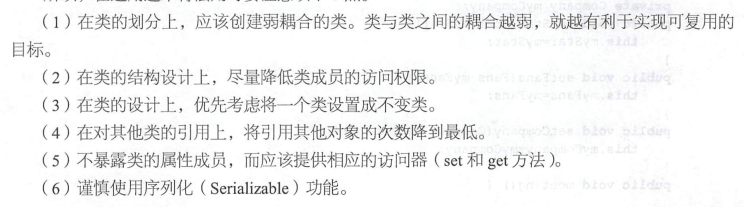

## 1. 开闭原则

软件实体：

+ 项目中划分出的模块
+ 类与接口
+ 方法

self：对增加开放，对修改关闭

standard：对扩展开放，对修改关闭

+ 对软件测试的影响
+ 可复用性
+ 可维护性：稳定性高，延续性强，从而易于扩展和维护

实现方法：

“抽象约束、封装变化”

通过接口和抽象类为软件实体定义一个相对稳定的抽象层，将相同的可变因素封装在相同的具体实现类中

## 2. 里氏替换原则

standard：继承必须确保超类所拥有的性质在子类中依然成立

作用：

+ 里氏替换原则是实现开闭原则的重要方式之一
+ 克服了继承中重写父类造成的可复用性变差的缺点
+ 动作正确性的保证。即类的扩展不会给已有的系统引入新的错误，降低了代码出错的可能性

通俗来讲：子类可以扩展父类的功能，但不能改变父类原有的功能

子类继承父类时，除添加新的方法完成新增功能外，尽量不要重写父类的方法


## 3. 依赖倒置原则

standard：

​	高层模块不应该依赖底层模块，两者都应该依赖其抽象；

​	抽象不应该依赖细节，细节应该依赖抽象。

依赖倒置原则是实现开闭原则的重要途径之一。

抽象：接口或者抽象类

细节：具体的实现类

作用：

+ 降低类间的耦合性
+ 提高系统的稳定性
+ 减少并行开发引起的风险
+ 提高代码的可读性和可维护性


依赖倒置原则应该遵循的原则：

+ 每个类尽量提供接口或抽象类，或者两者都具备
+ 变量的声明类型尽量是接口或抽象类
+ 任何类不应该从具体类派生
+ 使用继承时尽量遵循里氏替换原则

```java
class Customer{
    public void shopping(ShaoguanShop shop){
        // 购物
        System.out.println(shop.sell());
    }
}

class Customer{
    public void shopping(Wuyuan shop){
        // 购物
        System.out.println(shop.sell());
    }
}
```

```java
class Customer{
    public void shopping(Shop shop){
        // 购物
        System.out.println(shop.sell());
    }
}
interface Shop{
    // 卖
    public String sell();
}
class ShaoguanShop implements Shop{
    public String sell(){
        return "韶关土特产：香菇、木耳……";
    }
}
class WuyuanShop implements Shop{
    public String sell(){
        return "婺源土特产：绿茶、酒糟鱼……";
    }
}

public class DIPtest{
    public static void main(String[] args){
        Customer Wang = new Customer();
        System.out.println("顾客购买以下商品：");
        wang.shopping(new ShaoguanShop());
        wang.shopping(new WuyuanShop());
    }
}
```


## 4. 单一职责原则

职责：类变化的原因

standard：一个类应该有且只有一个引起它变化的原因，否则类应该被拆分

如果一个对象承担了太多职责，缺点：

+ 一个职责的变化可能会削弱或者抑制这个类实现其他职责的能力；
+ 当客户端需要该对象的某一个职责时，不得不将其他不需要的职责全部包含进来，从而造成冗余代码或代码的浪费

单一职责原则的核心：控制类的粒度大小、将对象解耦、提高其内聚性。

优点：

+ 降低类的复杂度。一个类只负责一项原则，其逻辑肯定比负责多项职责简单的多
+ 提高类的可读性。复杂性降低，自然其可读性会提高
+ 提高系统的可维护性。可读性提高，更容易维护
+ 变更引起的风险降低。

实现方法：

类、方法

—— 如果一个类或方法或模块处理的事情太多，其颗粒度会变得很粗，不利于重用

设计人员发现不同职责并将其分离，再封装到不同的类或模块中

发现类的多重职责需要设计人员具有较强的分析设计能力和相关重构经验

示例：大学生工作管理程序

学生生活辅导：—— 辅导员

+ 班委建设、出勤统计、心里辅导、费用催缴、班级管理等

学生学业指导： —— 学业导师

+ 专业引导、学习辅导、科研指导、学习总结等


## 5. 接口隔离原则

庞大接口拆分，更小和更具体的接口，让接口中只包含用户感兴趣的方法

一个类对另一个类的依赖应该建立在最小的接口上

解释：

要为各个类建立它们的专用接口，而不要试图去建立一个很庞大的接口供所有依赖它的类去调用

接口隔离原则以及单一职责原则都是为了提高类的内聚性、降低它们之间的耦合性，体现的是封装的思想，不同在于：

+ 单一职责原则注重的是职责，接口隔离原则注重的是对接口依赖的隔离
+ 单一职责原则是约束类（或方法），针对的是程序中的实现和细节；接口隔离原则主要约束接口，主要针对抽象和程序整体框架的构建

优点：

接口隔离原则是为了约束接口、降低类对接口的依赖性，遵循接口隔离原则

+ 庞大接口分解为多个粒度小的接口，可以预防外来变更的扩散，提高系统的灵活性和可维护性
+ 提高了系统内聚性，减少了对外交互，降低了系统的耦合性
+ 需要粒度大小定义合理，太大，灵活性降低，无法提供定制服务，太小，接口数量过多，设计复杂化
+ 多个专门的接口能够体现对象的层次，因为通过接口的继承实现对总接口的定义
+ 减少项目工程中的代码冗余

实现方法：

+ 接口尽量小，但要有限度。一个接口只服务于一个子模块或业务逻辑
+ 为依赖接口的类定制服务。只提供调用者需要的方法，屏蔽不需要的方法
+ 了解环境，拒绝盲从。通过业务逻辑，拆分接口。
+ 提高内聚，减少对外交互。

示例：学生成绩管理程序

插入成绩、删除成绩、修改成绩

计算总分、计算均分

打印成绩信息、查询成绩信息


```java
// 输入模块接口
interface InputModule{
    void insert();
    void delete();
    void modify();
}
// 统计模块接口
interface CountModule{
    void countTotalScore();
    void countAverage();
}
// 打印模块接口
interface PrintModule{
    void printStuInfo();
    void queryStuInfo();
}

// 实现类
class StuScoreList implements InputModule, CountModule, PrintModule{
    private StuScoreList(){}
    
    public static InputModule getInputModule(){
        return (InputModule)new StuScoreList();
    }
    public static CountModule getCountModule(){
        return (CountModule)new StuScoreList();
    }
    public static PrintModule getPrintModule(){
        return (PrintModule)new StuScoreList();
    }
    
    public void insert(){
        System.out.println("输入模块的insert()方法被调用");
    }
    public void delete(){
        System.out.println("输入模块的delete()方法被调用");
    }
    public void modify(){
        System.out.println("输入模块的modify()方法被调用");
    }
    
    public void countTotalScore(){
        System.out.println("统计模块的countTotalScore()方法被调用");
    }
    public void countAverage(){
        System.out.println("统计模块的countAverage()方法被调用");
    }
    
    public void printStuInfo(){
        System.out.println("打印模块的printStuInfo()方法被调用");
    }
    public void queryStuInfo(){
        System.out.println("打印模块的queryStuInfo()方法被调用");
    }
}
```


## 6. 迪米特法则

standard：只与你的直接朋友交谈，不跟“陌生人”说话

如果两个软件实体无需直接通信，那么就不应当发生直接的相互调用，可以通过第三方转发该调用。

目的：降低类之间的耦合度，提高模块的相对独立性

朋友：当前对象本身、当前对象的成员对象、当前对象所创建的对象、当前对象的方法参数等

这些对象同当前对象存在关联、聚合或组合关系，可以直接访问这些对象的方法


从依赖者的角度：只依赖应该依赖的对象

从被依赖者的角度：只暴露应该暴露的方法




示例：明星与经济人


## 7. 合成复用原则

组合/聚合复用原则

standard：在软件复用时，要尽量先用组合或者聚合等关联关系来实现，其次才考虑使用继承关系来实现。

如果要使用继承关系，则必须严格遵循里氏替换原则。

合成复用原则同里氏替换原则是相辅相成的，两者都是开闭原则的具体实现规范


## 8. 7种设计原则的要点

各种原则要求的侧重点不同

开闭原则是总纲：对扩展开放，对修改关闭

里氏替换原则：不要破坏继承体系

依赖倒置原则：面向接口编程

单一职责原则：实现类要职责单一

接口隔离原则：设计接口的时候要精简单一

迪米特法则：降低耦合度

合成复用原则：优先使用组合或聚合关系复用，少用继承关系复用

