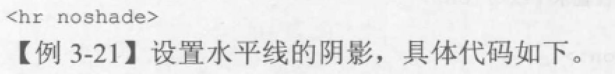

# 基本结构

```html
<html>
    <head>
        网页头部
        用来描述网页的相关内容，如网页标题、网页语言、和网页内容简述等
        <title>
            HTML文件的标题
            将要在浏览器的标题栏中显示的页面标题
        </title>
    </head>
    <body>
        <!-- 相关注释 -->
        网页正文
        在浏览器中显示出来供读取的信息
    </body>
</html>
```


# 标题

```html
<html>
    <head>
        网页头部
        用来描述网页的相关内容，如网页标题、网页语言、和网页内容简述等
        <title>
            HTML文件的标题
            将要在浏览器的标题栏中显示的页面标题
        </title>
    </head>
    <body>
        <!-- 相关注释 -->
        网页正文
        在浏览器中显示出来供读取的信息
        <!-- 格式辅助标记：标题，1~6级 -->
        <H1>
            格式辅助标记：1级标题
        </H1>
        <H2>
            格式辅助标记：2级标题
        </H2>
        <H3>
            格式辅助标记：3级标题
        </H3>
        <H4>
            格式辅助标记：4级标题
        </H4>
        <H5>
            格式辅助标记：5级标题
        </H5>
        <H6>
            格式辅助标记：6级标题
        </H6>
    </body>
</html>
```

# 表格

```html
<html>
    <head>
        网页头部
        用来描述网页的相关内容，如网页标题、网页语言、和网页内容简述等
        <title>
            HTML文件的标题
            将要在浏览器的标题栏中显示的页面标题
        </title>
    </head>
    <body>
        <!-- 水平线 -->
        <hr>

        <!-- 表格 -->
        <table> <!-- 开始绘制表格 -->
            <tr>    <!-- 行标记 -->
                <th>    <!-- 表头单元格 - 包含表头信息（由 th 元素创建）-->
                    表头：1
                    &nbsp;
                </th>
                <th>
                    表头：2
                    &nbsp;
                </th>
                <th>
                    表头：3
                    &nbsp;
                </th>
            </tr>
            <tr>    <!-- 行标记 -->
                <td>    <!-- 列标记，标准单元格 - 包含数据（由 td 元素创建） -->
                    单元格：1
                    &nbsp;
                </td>
                <td>
                    单元格：2
                    &nbsp;
                </td>
                <td>
                    单元格：3
                    &nbsp;
                </td>
            </tr>
            <tr>    <!-- 行标记 -->
                <td>    <!-- 列标记 -->
                    单元格：4
                </td>
                <td>
                    单元格：5
                </td>
                <td>
                    单元格：6
                </td>
            </tr>
        </table>
    </body>
</html>
```

# 段落

```html
<html>
    <head>
        网页头部
        用来描述网页的相关内容，如网页标题、网页语言、和网页内容简述等
        <title>
            HTML文件的标题
            将要在浏览器的标题栏中显示的页面标题
        </title>
    </head>
    <body>
        <!-- 水平线 -->
        <hr>
        <p>段落标记</p>
        <p>排版整齐</p>
        <!-- 水平线 -->
        <hr>
    </body>
</html>
```

# 字体标记

```html
<html>
    <head>
        网页头部
        用来描述网页的相关内容，如网页标题、网页语言、和网页内容简述等
        <title>
            HTML文件的标题
            将要在浏览器的标题栏中显示的页面标题
        </title>
    </head>
    <body>
        <!-- 水平线 -->
        <hr>
        <p><font size=-1>字体标记-1</font></p>
        <p><font size=2>字体标记2</font></p>
            
            <font size=3>字体标记3</font>
            <font size=4>字体标记4</font>
        <!-- 水平线 -->
        <hr>
    </body>
</html>
```

# 位置控制标记

```html
<div align = #>
<!-- # = left/right/center -->
    
    
<html>
    <head>
        网页头部
        用来描述网页的相关内容，如网页标题、网页语言、和网页内容简述等
        <title>
            HTML文件的标题
            将要在浏览器的标题栏中显示的页面标题
        </title>
    </head>
    <body>
        <!-- 水平线 -->
        <hr>
        <p align = right>段落标记</p>
        <p align = left>排版整齐</p>
        <p align = center>再来一段</p>
        <!-- 水平线 -->
        <hr>
    </body>
</html>
```

# 列表标记

```html
<html>
    <head>
        网页头部
        用来描述网页的相关内容，如网页标题、网页语言、和网页内容简述等
        <title>
            HTML文件的标题
            将要在浏览器的标题栏中显示的页面标题
        </title>
    </head>
    <body>
        <!-- 水平线 -->
        <hr>
        <!-- 无序列表 -->
        <ul>
            <li>
                one
            </li>
            <li>
                two
            </li>
            <li>
                three
            </li>
        </ul>

        <hr>
        <!-- 有序列表 -->
        <ol>
            <li>
                one
            </li>
            <li>
                two
            </li>
            <li>
                three
            </li>
        </ol>
        <!-- 水平线 -->
        <hr>
    </body>
</html>
```

# 定义列表

```html
<html>
    <head>
        网页头部
        用来描述网页的相关内容，如网页标题、网页语言、和网页内容简述等
        <title>
            HTML文件的标题
            将要在浏览器的标题栏中显示的页面标题
        </title>
    </head>
    <body>
        <!-- 水平线 -->
        <hr>
        <!-- 无序列表 -->
        <dl>
            <dt>第一项</dt>
            <dd>第一项说明</dd>
            
            <dt>第二项</dt>
            <dd>第二项说明</dd>
        </dl>
        <!-- 水平线 -->
        <hr>
    </body>
</html>
```

# 链接

```html
<a href='资源地址'>链接文字</a>
<html>
    <head>
        网页头部
        用来描述网页的相关内容，如网页标题、网页语言、和网页内容简述等
        <title>
            HTML文件的标题
            将要在浏览器的标题栏中显示的页面标题
        </title>
    </head>
    <body>
        <a href="http://www.baidu.com">百度</a>
    </body>
</html>
```

# 其他标签

## \<br\> —— 强制换行标签

## \<form\> ——表单标签

用来收集浏览者的信息，它可以包含让用户输入文本和选择项目的表单对象。

例如，文本域、按钮、复选框（checkbox）、单选按钮（radio button）和选择列表

在交易单的每个表单对象必须和输入标签\<input\>或者选择标签\<selection\>一起定义；交易单中的所有对象必须在\<form\>......\</form\>之间定义。

\<option\>

\<textarea\>文本域

```html
<form action="">
    用户名：<input type="text">
</form>

<html>
    <head>
        网页头部
        用来描述网页的相关内容，如网页标题、网页语言、和网页内容简述等
        <title>
            HTML文件的标题
            将要在浏览器的标题栏中显示的页面标题
        </title>
    </head>
    <body>
        <form action="">
            用户名：<input type="text" /> <br /><br />
            密码：<input type="password" /> <br /><br />
            兴趣爱好：<input type="checkbox" />篮球<input type="checkbox" />足球<input type="checkbox" />羽毛球
            性别：<input type="radio" />男 <input type="radio" />女<br /><br />
            选择文件：<input type="file" /> <br /><br />
            <input type="submit" />
            <input type="reset" />
            <input type="image" src="xxx.png"/>
            <input type="button" value="注册" />
            <input type="hidden" />
        </form>
    </body>
</html>

<html>
    <head>
        网页头部
        用来描述网页的相关内容，如网页标题、网页语言、和网页内容简述等
        <title>
            HTML文件的标题
            将要在浏览器的标题栏中显示的页面标题
        </title>
    </head>
    <body>
        <form action="" method="">
            用户名：<input type="text" /> <br /><br />
            密码：<input type="password" /> <br /><br />
            兴趣爱好：<input type="checkbox" />篮球<input type="checkbox" />足球<input type="checkbox" />羽毛球
            性别：<input type="radio" />男 <input type="radio" />女<br /><br />
            选择文件：<input type="file" /> <br /><br />
            <input type="submit" />
            <input type="reset" />
            <input type="image" src="xxx.png"/>
            <input type="button" value="注册" />
            <input type="hidden" />


            <select>

                <option value="1">内容1</option>
                
                <option value="2">内容2</option>
                
                <option value="3">内容3</option>
                
                </select>


                <textarea>
                    
                </textarea>
        </form>
    </body>
</html>
```

1，action：表示当前表单中的内容提交给哪个页面进行处理

2，method:表示当前表单提交的方式，常见的有get和post方式，默认是get提交


## \ 图像标签

```html
链接文字 </img>
```


## \<embed\> —— 内嵌音频文件标签

```html
<embed src="xxx.wav"></embed>
```

## \<bgsound\>——嵌入背景声音标签

```html
<bgsound src="url" loop=10>
```





