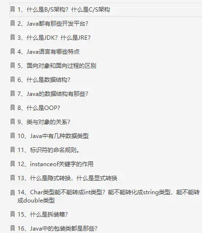

\1. Java 中的自增（i++）是线程安全的嘛？如何实现线程安全的自增？

\2. 其他常用的线程安全的类；

concurrentHashMap；

\3. ConcurrentHashMap是如何实现线程安全的？

\4. Synchronized是否是公平锁；

\5. ThreadLocal使用及原理？

\6. Jdk8中的stream有用过嘛？stream的并行操作原理？stream并行的线程池从哪里来的？

\7. Jdk1.8中的completableFuture有用过嘛？

\8. Spring AOP 和原生的aspect AOP有什么区别；

\9. Java 代理有几种实现方式？

\10. Jvm为什么要增加元空间（matespace）；

\11. Jvm中如何查看问题，并进行JVM调优？

\12. 对G1垃圾收集器有了解么，有什么特点？

\13. 服务器硬件配置？

\14. 在什么场景下升级配置，什么场景下去扩充集群？

\15. 为什么使用RPC框架？什么时候会使用http请求？

\16. 什么场景下会使用mq？mq的优势与劣势？什么时候不能用mq?（做不到同步）

\17. 为什么不对mysql的所有表都添加索引？

\18. Mysql索引为什么不用hash而用B+树？hash底层的时间复杂度是多少？

\19. B+树索引可以进行范围查询嘛，比如大于小于；

\20. 缓存数据如何同db同步进行更新？？？！！！（大厂都会问！）

\21. 链表：1->2->3->4->5；请写一个程序，将链表反转过来：5->4->3->2->1;

**第一步先自我介绍?**

介绍自己的项目经验和个人的擅长点，面试官主要考察你的**表达能力和语言精简能力**。

**第二步：项目中做了什么，难点在哪里?**

主要是想了解参与过技术难度最大的项目难点，技术难点在哪里，你是怎么来解决的，考察**项目经验(技术难度)**。

**第三步：开始切入技术面试正题：**

Java的线程池说一下，各个参数的作用，如何进行的?同步与异步区别？HashMap的实现原理，HashMap是如何解决hash冲突的问题？Redis讲一下，项目使用场景，以及对应的算法？分布式系统的全局id如何实现？用zookeeper如何实现的呢，机器号+时间戳即可？分布式锁的方案，redis和zookeeper那个好，如果是集群部署，高并发情况下哪个性能更好？kafka了解么，了解哪些消息队列？乐观锁，悲观锁?IO和NIO的却别，以及NIO的原理，有了解过mina？JVM内存模型，JVM加载原理，回收算法了解？**第四步： 你是想做业务还是研究？**

主要是想考察你对技术是否有深入的研究兴趣，建议回答喜欢研究，毕竟招聘的是技术岗位。

**阿里技术二面：**

1 介绍你做的项目和其中的难点？

2 反射的作用是什么？

3 数据仓库，多线程和并发工具等？

4 私有云，docker和k8s等？

5 了解哪些中间件，dubbo，rocketmq，mycat等？

6 dubbo中的rpc如何实现？

7 自己实现rpc应该怎么做？

9 dubbo的服务注册与发现？

10 听说我是非科班，于是问了些排序算法

**面试耗时将近30分钟。**

**阿里技术三面：**

三面不是面试，而是笔试，耗时三个小时，考的是Java核心的基础。

大概说一下就是有几个考点：

Java并发的知识点集合类线程池多线程之间的通信**面试耗时将近40分钟。**

**阿里HR面：**

聊人生谈理想，主要还是考察你对工作是否持积极的态度，以及你是否稳定,自信发挥就可以了。

**并发编程：**

什么是多线程并发和并行？什么是线程安全问题？什么是共享变量的内存可见性问题？什么是Java中原子性操作？什么是Java中的CAS操作,AtomicLong实现原理？什么是Java指令重排序？Java中Synchronized关键字的内存语义是什么？Java中Volatile关键字的内存语义是什么？什么是伪共享,为何会出现，以及如何避免？什么是可重入锁、乐观锁、悲观锁、公平锁、非公平锁、独占锁、共享锁？讲讲ThreadLocal 的实现原理？ThreadLocal 作为变量的线程隔离方式，其内部是如何做的？说说InheritableThreadLocal 的实现原理？InheritableThreadLocal 是如何弥补 ThreadLocal 不支持继承的特性？CyclicBarrier内部的实现与 CountDownLatch 有何不同？随机数生成器 Random 类如何使用 CAS 算法保证多线程下新种子的唯一性？ThreadLocalRandom 是如何利用 ThreadLocal 的原理来解决 Random 的局限性？Spring 框架中如何使用 ThreadLocal 实现 request scope 作用域 Bean？并发包中锁的实现底层（对AQS的理解）？讲讲独占锁 ReentrantLock 原理？谈谈读写锁 ReentrantReadWriteLock 原理？StampedLock 锁原理的理解？谈下对基于链表的非阻塞无界队列 ConcurrentLinkedQueue 原理的理解？ConcurrentLinkedQueue 内部是如何使用 CAS 非阻塞算法来保证多线程下入队出队操作的线程安全？基于链表的阻塞队列 LinkedBlockingQueue 原理。阻塞队列LinkedBlockingQueue 内部是如何使用两个独占锁 ReentrantLock 以及对应的条件变量保证多线程先入队出队操作的线程安全？为什么不使用一把锁，使用两把为何能提高并发度？谈谈对无界优先级队列 PriorityBlockingQueue 原理？PriorityBlockingQueue 内部使用堆算法保证每次出队都是优先级最高的元素，元素入队时候是如何建堆的，元素出队后如何调整堆的平衡的？分析下JUC 中倒数计数器 CountDownLatch 的使用与原理？CountDownLatch 与线程的 Join 方法区别是什么？讲讲对JUC 中回环屏障 CyclicBarrier 的使用？Semaphore 的内部实现是怎样的？简单对比同步器实现，谈谈你的看法？并发组件CopyOnWriteArrayList 是如何通过写时拷贝实现并发安全的 List？**JVM**

Java 内存分配？Java 堆的结构是什么样子的？什么是堆中的永久代（Perm Gen space）?简述各个版本内存区域的变化？说说各个区域的作用？Java 中会存在内存泄漏吗，简述一下？Java 类加载过程？描述一下 JVM 加载 Class 文件的原理机制?什么是类加载器？类加载器有哪些？什么是tomcat类加载机制？类加载器双亲委派模型机制？什么是GC? 为什么要有 GC？简述一下Java 垃圾回收机制？如何判断一个对象是否存活？垃圾回收的优点和原理，并考虑 2 种回收机制？垃圾回收器的基本原理是什么？垃圾回收器可以马上回收内存吗？有什么办法主动通知虚拟机进行垃圾回收？深拷贝和浅拷贝？System.gc() 和 Runtime.gc() 会做些什么？如果对象的引用被置为 null，垃圾收集器是否会立即释放对象占用的内存？什么是分布式垃圾回收（DGC）？它是如何工作的？串行（serial）收集器和吞吐量（throughput）收集器的区别是什么？在 Java 中，对象什么时候可以被垃圾回收？简述Minor GC 和 Major GC？JVM 的永久代中会发生垃圾回收么？Java 中垃圾收集的方法有哪些？讲讲你理解的性能评价及测试指标？常用的性能优化方式有哪些？说说分布式缓存和一致性哈希？同步与异步？阻塞与非阻塞？什么是GC调优？常见异步的手段有哪些？**Spring**

为什么需要代理模式？讲讲静态代理模式的优点及其瓶颈？对Java 接口代理模式的实现原理的理解？如何使用 Java 反射实现动态代理？Java 接口代理模式的指定增强？谈谈对Cglib 类增强动态代理的实现？point cut，advice，Join point是什么？join point 和 point cut 的区别？怎么理解面向切面编程的切面？谈谈对SpringAOP Weaving（织入）的理解？谈谈SpringAOP Introduction（引入）的理解？讲解OOP与AOP的简单对比？讲解JDK 动态代理和 CGLIB 代理原理以及区别？讲解Spring 框架中基于 Schema 的 AOP 实现原理？讲解Spring 框架中如何基于 AOP 实现的事务管理？谈谈对控制反转的设计思想的理解？怎么理解 Spring IOC 容器？Spring 中有多少种 IOC 容器？Spring IOC 怎么管理 Bean 之间的依赖关系，怎么避免循环依赖？对Spring IOC 容器的依赖注入的理解？说说对Spring IOC 的单例模式和高级特性？BeanFactory 和 FactoryBean 有什么区别，BeanFactory 和 ApplicationContext 又有什么不同？Spring 在 Bean 创建过程中是如何解决循环依赖的？谈谈Spring Bean 创建过程中的设计模式？**数据库**

MySQL 有哪些存储引擎啊？都有什么区别？Float、Decimal 存储金额的区别？Datetime、Timestamp 存储时间的区别？Char、Varchar、Varbinary 存储字符的区别？什么是索引？对比一下B+树索引和 Hash索引？MySQL索引类型有？如何管理 MySQL索引？对Explain参数及重要参数的理解？索引利弊是什么及索引分类？二叉树的转置是什么？聚簇索引和非聚簇索引的区别？B+tree 如何进行优化？索引遵循哪些原则？存储引擎会进行哪些自动优化？到底何时索引会失效？索引与锁有什么关系？还有什么其他的索引类型，各自索引有哪些优缺点？谈谈对Innodb事务的理解？说说数据库事务特点及潜在问题？什么是MySQL隔离级别？有多少种事务失效的场景，如何解决？一致性非锁定读和一致性锁定读是什么？Innodb如何解决幻读？讲讲Innodb行锁？死锁及监控是什么？自增长与锁 ，锁的算法，锁问题，锁升级是什么？乐观锁的线程如何做失败补偿？高并发场景（领红包）如何防止死锁，保证数据一致性？谈谈MySQL的锁并发？回表和集群因子是什么？讲讲表与表之间的关系？了解查询优化器模块；查询优化的基本思路是什么？说说MySQL读写分离、分库分表？Query语句对数据库性能有什么影响？Schema设计对系统性能有什么影响？硬件环境对数据库的性能有什么影响？表结构对性能有什么影响?浅谈索引优化？JOIN的原理是什么？说说Sql优化的几点原则？MySQL表设计及规范？说说MySQL几种存储引擎应用场景？MySQL常用优化方式有哪些？MySQL常用监控？MySQL瓶颈分析？**面试经验总结**

一定要谨慎对待写在简历上的东西，一定要对简历上的东西非常熟悉。因为一般情况下，面试官都是会根据你 的简历来问的；能有一个上得了台面的项目也非常重要，这很可能是面试官会大量发问的地方，所以在面试 之前好好回顾一下自己所做的项目；和面试官聊基础知识比如设计模式的使用、多线程的使用等等，可以结合具体的项目场景或者是自己在平时是 如何使用的；建议提前了解一下自己想要面试的公司的价值观，判断一下自己究竟是否适合这个公司。另外，我个人觉得面试也像是一场全新的征程，失败和胜利都是平常之事。所以，劝各位不要因为面试失败而灰心、 丧失斗志。也不要因为面试通过而沾沾自喜，等待你的将是更美好的未来，继续加油！

作者：奇点
链接：https://www.zhihu.com/question/382918132/answer/1110408672
来源：知乎
著作权归作者所有。商业转载请联系作者获得授权，非商业转载请注明出处。

**面试题-基础篇**

[Java基础篇—Java开发面试题1期](https://link.zhihu.com/?target=http%3A//mp.weixin.qq.com/s%3F__biz%3DMzAwMTE3MDY4MQ%3D%3D%26mid%3D2652433246%26idx%3D1%26sn%3Dd130dbba555f766955d0ba0799a7bfdb%26chksm%3D813186c8b6460fdee16df20f8f6c1187ad54a4fee0f1414986352089fa49861fa9b066655e3e%26scene%3D21%23wechat_redirect)

[Java基础篇—Java开发面试题2期](https://link.zhihu.com/?target=http%3A//mp.weixin.qq.com/s%3F__biz%3DMzAwMTE3MDY4MQ%3D%3D%26mid%3D2652433250%26idx%3D1%26sn%3D0232b476894ab4ddeb5fc57fbba86d90%26chksm%3D813186f4b6460fe2c50973c7bab70b7ae8db9bd49ecbee621e4bd9a16ab495a1a61665097468%26scene%3D21%23wechat_redirect)[Java基础篇—Java开发面试题3期](https://link.zhihu.com/?target=http%3A//mp.weixin.qq.com/s%3F__biz%3DMzAwMTE3MDY4MQ%3D%3D%26mid%3D2652433254%26idx%3D1%26sn%3Dfca332f4090c7807e0ab2ec9207e27b3%26chksm%3D813186f0b6460fe65412b8db3c193e5109aba194849e0176a248c1163f289b36e4703da517c8%26scene%3D21%23wechat_redirect)

[Java基础篇—Java开发面试题4期](https://link.zhihu.com/?target=http%3A//mp.weixin.qq.com/s%3F__biz%3DMzAwMTE3MDY4MQ%3D%3D%26mid%3D2652433259%26idx%3D1%26sn%3De9dbc51f62bf36d4c518efb5f758b18e%26chksm%3D813186fdb6460feb8210c2a637a144836d076d8689882d721dfd4289d5953a1c9b61bb713636%26scene%3D21%23wechat_redirect)

[Java基础篇—Java开发面试题5期](https://link.zhihu.com/?target=http%3A//mp.weixin.qq.com/s%3F__biz%3DMzAwMTE3MDY4MQ%3D%3D%26mid%3D2652433266%26idx%3D1%26sn%3D2cef3ff485a2860b30331af50cb94b0a%26chksm%3D813186e4b6460ff2c28decde6354bf92c9ed158f03b9d153517fa08a2b632b93b1f0c5f3ad4a%26scene%3D21%23wechat_redirect)

[Java基础篇—Java开发面试题6期](https://link.zhihu.com/?target=http%3A//mp.weixin.qq.com/s%3F__biz%3DMzAwMTE3MDY4MQ%3D%3D%26mid%3D2652433274%26idx%3D1%26sn%3De78ca55a6501e513c9f25e32d67a2c6e%26chksm%3D813186ecb6460ffa74cc7e2ebf8e2f5019ddb493a729917bcb7a913e0ccd65a5853731bb6fba%26scene%3D21%23wechat_redirect)

[Java基础篇—Java开发面试题7期](https://link.zhihu.com/?target=http%3A//mp.weixin.qq.com/s%3F__biz%3DMzAwMTE3MDY4MQ%3D%3D%26mid%3D2652433278%26idx%3D1%26sn%3Ddb9c0fa6d93013e4f8973419c2aab145%26chksm%3D813186e8b6460ffe7819db414b423847dcf3d373d17559ef03f08487525342de8abea4e1238d%26scene%3D21%23wechat_redirect)

[Java基础篇—Java开发面试题8期](https://link.zhihu.com/?target=http%3A//mp.weixin.qq.com/s%3F__biz%3DMzAwMTE3MDY4MQ%3D%3D%26mid%3D2652433293%26idx%3D1%26sn%3D6a3600c96d81baabdaf6ae61e65187b1%26chksm%3D8131861bb6460f0d72923603346e76dc4af1913b188032dba6159c79cc6897d8629628ccbc92%26scene%3D21%23wechat_redirect)

[Java基础篇—Java中switch case语句用法及注意事项面试题9期](https://link.zhihu.com/?target=http%3A//mp.weixin.qq.com/s%3F__biz%3DMzAwMTE3MDY4MQ%3D%3D%26mid%3D2652433359%26idx%3D1%26sn%3D658d314bd110e2ea830fc0cecb261f25%26chksm%3D81318659b6460f4f884f802e464507d0f675fbf0b9edf1f13752ec429263873646bba965a09e%26scene%3D21%23wechat_redirect)[Java基础篇—Map集合类简介和使用原理剖析](https://link.zhihu.com/?target=http%3A//mp.weixin.qq.com/s%3F__biz%3DMzAwMTE3MDY4MQ%3D%3D%26mid%3D2652433097%26idx%3D1%26sn%3Dee90f729e3d4a5e447dc40258ff0e32a%26chksm%3D8131875fb6460e49db1582101f6f1d348ec0cc3da52a4558171bca7c5636189ebaedd625e62c%26scene%3D21%23wechat_redirect)

[Java基础篇—多线程概念和使用原理分析](https://link.zhihu.com/?target=http%3A//mp.weixin.qq.com/s%3F__biz%3DMzAwMTE3MDY4MQ%3D%3D%26mid%3D2652433090%26idx%3D1%26sn%3D1d79b4bd872f94ee2e6d8431a0a4697a%26chksm%3D81318754b6460e429870ff989d527b0406daa58d0571ceaf25920386013a3622b8fff2ed425c%26scene%3D21%23wechat_redirect)

[Java基础篇—深入理解反射机制的基本概念与使用](https://link.zhihu.com/?target=http%3A//mp.weixin.qq.com/s%3F__biz%3DMzAwMTE3MDY4MQ%3D%3D%26mid%3D2652433393%26idx%3D1%26sn%3D2bcdaba1a4fbc840ff4ab9a20f47fa61%26chksm%3D81318667b6460f71968b956f45757d74e006d76695f6282a85866f789e7e22b23facebc6e83f%26scene%3D21%23wechat_redirect)

**面试题-中级篇**

[Java面试题基本数据类型自动装箱和自动拆箱原理剖析](https://link.zhihu.com/?target=http%3A//mp.weixin.qq.com/s%3F__biz%3DMzAwMTE3MDY4MQ%3D%3D%26mid%3D2652433083%26idx%3D1%26sn%3Dc8bc172c140f23a3e24c9e9be68e9a61%26chksm%3D8131872db6460e3b8f63808274d9a7f2cbd999b8eecb249dc12973c9ef672b5b3f531f218124%26scene%3D21%23wechat_redirect)[Java中Math.random()与Random类生成随机数及源码分析](https://link.zhihu.com/?target=http%3A//mp.weixin.qq.com/s%3F__biz%3DMzAwMTE3MDY4MQ%3D%3D%26mid%3D2652434138%26idx%3D1%26sn%3D1d0a0bfab9b9cd3d8ce19efced18a4b1%26chksm%3D8131834cb6460a5a7014250d8b003c7b02de621212ac4d0f9ce7e1ac6ec9b47f9e5e6f5fe294%26scene%3D21%23wechat_redirect)[Java 中对于位运算的优化以及运用与思考](https://link.zhihu.com/?target=http%3A//mp.weixin.qq.com/s%3F__biz%3DMzAwMTE3MDY4MQ%3D%3D%26mid%3D2652434148%26idx%3D1%26sn%3D377d16a0d09de09513d7d0d77a73fe01%26chksm%3D81318372b6460a64daa44b85445158a7d15558c729b0d7bd704db6a5cce6f9443f1db448a0ed%26scene%3D21%23wechat_redirect)

**面试题-高级篇**

[Java面试高级篇—HashMap源码实现原理及底层结构面试题9期](https://link.zhihu.com/?target=http%3A//mp.weixin.qq.com/s%3F__biz%3DMzAwMTE3MDY4MQ%3D%3D%26mid%3D2652433301%26idx%3D1%26sn%3Ddbdbae2bb7700cc119c68e6cd17eb5fb%26chksm%3D81318603b6460f1568966e452021c430dd0aa8c60e44f89515f1030ea1f35bda625b5ba8ad10%26scene%3D21%23wechat_redirect)

[Java面试高级篇—Java中的队列都有哪些，有什么区别面试题10期](https://link.zhihu.com/?target=http%3A//mp.weixin.qq.com/s%3F__biz%3DMzAwMTE3MDY4MQ%3D%3D%26mid%3D2652433302%26idx%3D1%26sn%3D2c51d1990fbdd2c917bc3cdc00508a72%26chksm%3D81318600b6460f16999b502073453bdcda0f5ccbfd6e211b3f327a5567e117d3df535f0d9e8e%26scene%3D21%23wechat_redirect)

[Java面试高级篇—Hash冲突怎么办，哪些解决散列冲突的方法？面试题11期](https://link.zhihu.com/?target=http%3A//mp.weixin.qq.com/s%3F__biz%3DMzAwMTE3MDY4MQ%3D%3D%26mid%3D2652433309%26idx%3D1%26sn%3D5761cb8bb76e39c2a56c74bdab51e68e%26chksm%3D8131860bb6460f1d64c26b58dc31c2b49709de1f75e0a68dac11cbe8d5f187dcf45b2f6a24fc%26scene%3D21%23wechat_redirect)

[Java面试高级篇—说说TCP,UDP和socket,Http之间联系和区别面试题12期](https://link.zhihu.com/?target=http%3A//mp.weixin.qq.com/s%3F__biz%3DMzAwMTE3MDY4MQ%3D%3D%26mid%3D2652433338%26idx%3D1%26sn%3D46fdd79abd00248c8d48fae176673cff%26chksm%3D8131862cb6460f3a393a766035c7a74a3165b532f17cc8fdd2cd60f81ee85d9f9d1f0bac6051%26scene%3D21%23wechat_redirect)

[Java面试高级篇—Session和Cookie的区别与联系面试题13期](https://link.zhihu.com/?target=http%3A//mp.weixin.qq.com/s%3F__biz%3DMzAwMTE3MDY4MQ%3D%3D%26mid%3D2652433314%26idx%3D1%26sn%3D064e7db6c3a4631abd73d311595ac3d0%26chksm%3D81318634b6460f2290d85743fec09bbdd33ad30e3f4fcfa9d61f172c1cca6f9946465cc73be7%26scene%3D21%23wechat_redirect)

[Java面试高级篇—详谈Java四种线程池及new Thread的弊端面试题14期](https://link.zhihu.com/?target=http%3A//mp.weixin.qq.com/s%3F__biz%3DMzAwMTE3MDY4MQ%3D%3D%26mid%3D2652433344%26idx%3D1%26sn%3D304b27b2d562e4968e7f271a7d10417a%26chksm%3D81318656b6460f4047b1ce87094916c62ed271b3f8112af80be1125ea8cc1f94507b87dd1f05%26scene%3D21%23wechat_redirect)

[Java面试高级篇—Java NIO：浅析I/O模型面试题15期](https://link.zhihu.com/?target=http%3A//mp.weixin.qq.com/s%3F__biz%3DMzAwMTE3MDY4MQ%3D%3D%26mid%3D2652433349%26idx%3D1%26sn%3D7548f271dd01737f3765a03464bd6eb6%26chksm%3D81318653b6460f45740185b86c8dba98b05ed1c2846a6764334f97931fbab195d98db4a04309%26scene%3D21%23wechat_redirect)

[Java面试高级篇—Dubbo与Zookeeper面试题16期](https://link.zhihu.com/?target=http%3A//mp.weixin.qq.com/s%3F__biz%3DMzAwMTE3MDY4MQ%3D%3D%26mid%3D2652433495%26idx%3D1%26sn%3D7e396b19af6ffcd6857d4868746452b4%26chksm%3D813181c1b64608d70a762a15ccb4fa0954f521d1daef9f874ba873fe9042cf8bf4db540fc3d6%26scene%3D21%23wechat_redirect)

[Java面试高级篇—JavaIO流原理以及Buffered高效原理详解](https://link.zhihu.com/?target=http%3A//mp.weixin.qq.com/s%3F__biz%3DMzAwMTE3MDY4MQ%3D%3D%26mid%3D2652433492%26idx%3D1%26sn%3Ded9f820621e541cad075a9b49db44f09%26chksm%3D813181c2b64608d41fccabe4d041021761a2b8b0c71b0f61788a070fc107174878fedd922f67%26scene%3D21%23wechat_redirect)

**面试题-算法篇**

[Java算法篇—Java经典面试算法题01期](https://link.zhihu.com/?target=http%3A//mp.weixin.qq.com/s%3F__biz%3DMzAwMTE3MDY4MQ%3D%3D%26mid%3D2652433320%26idx%3D1%26sn%3D5fda675d386873c07e28b41635a67ac0%26chksm%3D8131863eb6460f2826dad5fe04f9fd5f41aa2905f04de0af8bf377ac744a64eb8b78c78ccb07%26scene%3D21%23wechat_redirect)

[Java算法篇—Java经典面试算法题02期](https://link.zhihu.com/?target=http%3A//mp.weixin.qq.com/s%3F__biz%3DMzAwMTE3MDY4MQ%3D%3D%26mid%3D2652433324%26idx%3D1%26sn%3D82c843ca2f6218840ab9157c40bd5421%26chksm%3D8131863ab6460f2cfd99def5cee48f7f1ae02faf39decac68763ac11dd1dd218645cc9445242%26scene%3D21%23wechat_redirect)

[Java算法篇—Java经典面试算法题03期](https://link.zhihu.com/?target=http%3A//mp.weixin.qq.com/s%3F__biz%3DMzAwMTE3MDY4MQ%3D%3D%26mid%3D2652433628%26idx%3D1%26sn%3D769557e890acbd87e62cd660a083c8e3%26chksm%3D8131814ab646085cf5e135bc994fc8e447caab00398f212d5ecad611dbb2d8c24f6a5e6eb441%26scene%3D21%23wechat_redirect)

**面试题-其他篇**

[常见Java内存溢出与解决方法详解](https://link.zhihu.com/?target=http%3A//mp.weixin.qq.com/s%3F__biz%3DMzAwMTE3MDY4MQ%3D%3D%26mid%3D2652433195%26idx%3D1%26sn%3D998dcb110bf230ac46d3bf25e6bbdf92%26chksm%3D813186bdb6460fabecf334600bac72d15ba93bf071fcc4d07c6a80cd1a666d4b1c004a41ac19%26scene%3D21%23wechat_redirect)[BAT等公司必问的8道Java经典面试题，你都会了吗？](https://link.zhihu.com/?target=http%3A//mp.weixin.qq.com/s%3F__biz%3DMzAwMTE3MDY4MQ%3D%3D%26mid%3D2652434118%26idx%3D1%26sn%3D913abe33cf2a8b3f93e3538cb600a0bb%26chksm%3D81318350b6460a46d1ec2e6e968a93db1f9f6f8e85f15b0c3eac8cb1f338800e46898c8d4a86%26scene%3D21%23wechat_redirect)

[工作10年，面试超100人想进“大厂”，总结出8大类面试题](https://link.zhihu.com/?target=http%3A//mp.weixin.qq.com/s%3F__biz%3DMzAwMTE3MDY4MQ%3D%3D%26mid%3D2652434152%26idx%3D1%26sn%3Da4c91b126bec562ecd8c32c97d81a325%26chksm%3D8131837eb6460a68dcb0e731af92913618684b2f889cd4ff4f96ea196e646d78006416cdefbd%26scene%3D21%23wechat_redirect)

[Java开发中常见路径问题的分析及解决方法，你会如何解决？](https://link.zhihu.com/?target=http%3A//mp.weixin.qq.com/s%3F__biz%3DMzAwMTE3MDY4MQ%3D%3D%26mid%3D2652434081%26idx%3D1%26sn%3Dbb104d37b279e9c076a1765def1ecb16%26chksm%3D81318337b6460a2169f7a786883ccf6f51719e3643efb60e6b5b9fbf43205012f3474138b119%26scene%3D21%23wechat_redirect)

[春招2020年面试不用愁，速看BATJ最新Java面试题整理合集](https://link.zhihu.com/?target=http%3A//mp.weixin.qq.com/s%3F__biz%3DMzAwMTE3MDY4MQ%3D%3D%26mid%3D2652433876%26idx%3D1%26sn%3D2000427b9d4abb90c6fa6158a2bb460f%26chksm%3D81318042b6460954bee32a10f24718aab541e854b842b34e7f20848dc1661de75fccc15121ed%26scene%3D21%23wechat_redirect)

[超级全面的总结MySQL数据库优化面试题分析](https://link.zhihu.com/?target=http%3A//mp.weixin.qq.com/s%3F__biz%3DMzAwMTE3MDY4MQ%3D%3D%26mid%3D2652433816%26idx%3D1%26sn%3D9353492a638701d3adef3f8ec45a1cbf%26chksm%3D8131800eb64609185353b29b6f5c0037e32784a5be080b22f3dd10927ca4c14d7abbc0c1e336%26scene%3D21%23wechat_redirect)

[搞不定Redis面试，速看全面Redis面试题及答案整理总结](https://link.zhihu.com/?target=http%3A//mp.weixin.qq.com/s%3F__biz%3DMzAwMTE3MDY4MQ%3D%3D%26mid%3D2652433841%26idx%3D1%26sn%3D75128da2c05b0217a5a9c501945cae8c%26chksm%3D81318027b64609311d86db943c0406de4fd5ba936d665926731970b17e6d2dbca9bb53500375%26scene%3D21%23wechat_redirect)

[搞不定MyBatis面试，速看全面MyBatis面试题及答案整理总结](https://link.zhihu.com/?target=http%3A//mp.weixin.qq.com/s%3F__biz%3DMzAwMTE3MDY4MQ%3D%3D%26mid%3D2652433919%26idx%3D1%26sn%3D32e9863fe08d2fbbd1cafc173f307a14%26chksm%3D81318069b646097ff679646f89b1c201860ae31b64e98eff4a51a7749f95140575362f125119%26scene%3D21%23wechat_redirect)

[搞不定Zookeeper面试，速看全面Zookeeper面试题及答案整理总结](https://link.zhihu.com/?target=http%3A//mp.weixin.qq.com/s%3F__biz%3DMzAwMTE3MDY4MQ%3D%3D%26mid%3D2652433959%26idx%3D1%26sn%3Db8539300095f9f77515fad29605fd591%26chksm%3D813183b1b6460aa73d289745ca977e890636c3daeb7d4b527f165f8b0c93b33cbe133f6d33da%26scene%3D21%23wechat_redirect)

[深入理解Java JVM虚拟机中init和clinit的区别](https://link.zhihu.com/?target=http%3A//mp.weixin.qq.com/s%3F__biz%3DMzAwMTE3MDY4MQ%3D%3D%26mid%3D2652433190%26idx%3D1%26sn%3D6e9bb6edac4ac735c33f1a3b59836636%26chksm%3D813186b0b6460fa61cd508e74d22984898bcfc50308b484fa2a04780ecdcd182238b7dc1c550%26scene%3D21%23wechat_redirect)

[互联网大厂Java面试题集—Spring boot面试题（一）](https://link.zhihu.com/?target=http%3A//mp.weixin.qq.com/s%3F__biz%3DMzAwMTE3MDY4MQ%3D%3D%26mid%3D2652433579%26idx%3D1%26sn%3D3e6cc41c280a8f8f93d216ca61249a3b%26chksm%3D8131813db646082b343c124e8944dc2748b263e5a8a25e8909372a00e34d16ef25da9ce7b99d%26scene%3D21%23wechat_redirect)

[互联网大厂Java面试题集—Spring boot常见面试题（二）](https://link.zhihu.com/?target=http%3A//mp.weixin.qq.com/s%3F__biz%3DMzAwMTE3MDY4MQ%3D%3D%26mid%3D2652433585%26idx%3D1%26sn%3Dc771dccda53b0ad4a39f4f15868b7104%26chksm%3D81318127b6460831f1223107fd9b8149881796891b2e51fc510a8d6150712570d1cdb63bdec4%26scene%3D21%23wechat_redirect)

**面试技巧篇**

[Java面试技巧—如何自我介绍](https://link.zhihu.com/?target=http%3A//mp.weixin.qq.com/s%3F__biz%3DMzAwMTE3MDY4MQ%3D%3D%26mid%3D2652433642%26idx%3D1%26sn%3Db82e2488fb92684072b6d870e9b78ca6%26chksm%3D8131817cb646086ae99a4ebc7c2f8b33a6bb2f0a24a65eedf9b952c9d050606cea2ef8d904d1%26scene%3D21%23wechat_redirect)

[Java面试技巧—面试者简历如何通过初步筛选](https://link.zhihu.com/?target=http%3A//mp.weixin.qq.com/s%3F__biz%3DMzAwMTE3MDY4MQ%3D%3D%26mid%3D2652433796%26idx%3D1%26sn%3Df5b07e2efe4e6f6a75d3eefbcdd9c10d%26chksm%3D81318012b646090460fc3d3d105ddc385c1a278bc3129b9cfad6990e9486c3e8a2ad80be20ca%26scene%3D21%23wechat_redirect)

**面试经验篇**

[浅谈Java后端开发工程师腾讯面试经历分享总结](https://link.zhihu.com/?target=http%3A//mp.weixin.qq.com/s%3F__biz%3DMzAwMTE3MDY4MQ%3D%3D%26mid%3D2652433660%26idx%3D1%26sn%3D2661ce81717dc65db8e8b124f6fef1a2%26chksm%3D8131816ab646087c78dda5cf3f0cf227e974ea86da7b424bb922318af5e4f2e19f7f52b33ee6%26scene%3D21%23wechat_redirect)

***第三步：优质简历\***

一份优秀的简历不一定能帮助求职者找到一份满意的工作，但能大大提升求职者的面试机会，从而间接的增加了面试成功通过率。

**什么是简历？**

如果想进大厂比如阿里，简历是求职者提交给用人单位以介绍说明个人基本情况、教育情况以及过往工作情况的书面文字资料，在用人单位没有面试之前，简历是可以帮助用人单位了解求职者的基本情况的主要途径。

**简历的重要性**

求职者简历的好坏完全取决于招聘者。有的人可能觉得自己的简历不错，为什么投出去就石沉大海，杳无音信？

其实很大的原因是求职者的简历并没有吸引住招聘者的眼球。在很大程度上是因为求职者只从自己的眼光看自己的简历，而没有从招聘者的立场看待自己的简历。

无论你的简历做的多么精美，你都要清楚一点，招聘者在筛选简历时根本没时间把你的简历看个遍。

筛选简历一般分为两个过程：先是初选阶段，这个过程很快，招聘者几乎每份简历只看几个关键词，10至20秒就会看完一份简历，有时候简历看完了，可能是男是女都不知道。初选通过的大概会选出投递20%左右的人进行复选。

复选阶段，招聘者会对每份简历详细的浏览一遍，主要是为了更进一步了解每位求职者，在简历中寻找几个有针对性的面试问题，这个阶段，淘汰率不是很高，基本上都会得到面试的机会。 

因此如果一个应聘者能通过初选，那么面试的机会也就不远了。在众多的简历中，为什么选择这份而不是选择那份呢？除了这个人符合招聘者的各项硬性要求外，一个很重要的理由就是这份简历符合招聘者的需求。 

**招聘者喜欢什么样的简历？**

简历遵循三个原则，清晰、简洁、精准，看上一眼就能抓住关键词。

“简历”这个词突出的是“简”，简历不是写论文，不能过于冗长，招聘者没有时间在你的长篇大论中帮你总结归纳他们需要的信息。

“简历”的“简”也不能理解成简单，要突出重点，在短短的的几页页纸中要把你的亮点展现出来，招聘者一般留下某份简历，多半是因为看到了简历中的某个词或某句话。

在制作简历之前，首先自身的思维逻辑一定要清晰，求职者可以从以下几方面下手：

1）自己的强项、弱项、个人喜好以及志向都有哪些，突出点在哪。

2）扬长避短，展示真实，抓关键词或者实用性的数据说话，避免冗长。

3）定位准确，根据单位招聘人才的要求，对号入座。

**简历需要彩打吗？**

在招聘中应该经常会有一些彩色打印的简历求职者，厚厚的一本，装帧精美，里面往往还会附上照片。一看就知道，求职者对自己的简历非常用心。不用多想，这份简历成本一定不菲。

求职者无非是想向招聘者传递这样一个信号，想把自己的简历弄的与众不同，让看简历的人眼前一亮，使自己被选中的机会大些。但是总是事与愿违。

其实简历是否彩打，对求职者的简历能否通过初选的作用并不如想象中那样大。很少有公司会注意到简历到底是彩打的，还是黑白的。

在这里，小编很坦率地告诉大家，无论求职者是否会被录用，最终的简历都会被保留在垃圾筒中，没有公司会浪费一分人力物力财力去保管求职者的简历。

别相信诸如“虽然你没有被录用,但是我们会把你的简历放到我们人才库中”这样的鬼话，所谓的人才库都是给内部员工准备的，外部人员的人才库其实就是垃圾筒。

**简历上需要附本人照片吗？**

简历上附不附照片，因人而易。

对于那些相貌出众，让人看一眼还想再多看几眼的求职者来说，附上一张效果不错的照片，会给你增加不少印象分。

对于那些相貌平平的人，最好别贴什么照片，这样的照片往往会达到适得其反的效果，让招聘者通过照片把你所有的优点全给否了。

注意的是应聘者不要在自己的简历上贴张很久以前的照片，这样会让人感觉就像是个孩子。

**如何在简历上贴照片**

1）本人很吸引人，可以附上一张照片。 

2）照片可以体现你的本色，不能刻意用明星照来美化自己。

3）照片必须能展示你现在的性格、特质，并能通过照片把你想要表达的意思有效地传达给招聘人员。 

4）不要选最漂亮的，那会让人期望太高。

面试
笔试常见的问题

面试常见的问题下面给的面试题基本都有。

1 手写代码：手写代码一般会考单例、排序、线程、消费者生产者 排序。

2 写SQL很常考察group by、内连接和外连接

2.面试1-5面总结
1）让你自我介绍 2）做两道算法题（刷题必中） 3）问Java基础知识 4）java 高级进阶就是我下面准备的那些 4）问项目中指责和做了什么 5）业务情景问题，例如：你的一个功能上了生产环境后，服务器压力骤增，该怎么排查。 6）对职业的规划 7）你有什么想问面试官 的 8）问期望待遇

3.常问的知识要点
1）集合相关问题（必问）：

2）线程相关问题（必问）：

3）JVM相关问题（必问）：

4）设计模式相关问题（必问）：

5）数据库相关问题，针对Mysql（必问）：

6）主流框架相关问题：Spring的设计模式。 Spring中AOP。 Spring注入bean的方式。 什么是IOC，什么是依赖注入。 Spring是单例还是多例，怎么修改。 Spring事务隔离级别和传播性。 介绍下Mybatis/Hibernate的缓存机制。 Mybatis的mapper文件中#和$的区别。 Mybatis的mapper文件中resultType和resultMap的区别。 Hibernate和Mybatis的区别。 Spring MVC和Struts2的区别。 Mybatis中DAO层接口没有写实现类，Mapper中的方法和DAO接口方法是怎么绑定到一起的，其内部是怎么实现的。

7）其他遇到问题： 介绍下B树、二叉树。 IO和NIO的区别。 重载和重写的区别。 栈和队列。 接口和抽象类的区别。 int和Integer的自动拆箱/装箱相关问题。 常量池相关问题。 ==和equals的区别。 String和StringBuilder、StringBuffer的区别。 静态变量、实例变量、局部变量线程安全吗，为什么。 try、catch、finally都有return语句时执行哪个。 分布式锁的实现。 分布式session存储解决方案。 常用的linux命令。

一些经验
0 .千万别裸辞，别裸辞，别裸辞 我同事裸辞了，2个月了到现在还没找到工作。

1.先投一些普通的小公司，等面出感觉了再去面大公司。

2.自己不会的技术简历不要写

3.很多公司压待遇，期望待遇适当提高。

4.不要去实习期6个月还打8折的公司，除非你没有其他选择了，否则不要去。

5.不要去参加很多大大小小的招聘会，纯粹是浪费时间。

6.把面试当作一次技术的交流，不要太在意是否能被录取。 就当学习。

7.公司一般面完就决定是否录取了，让你回去等消息这种情况一般没戏，感觉良好也没用。

8.地方远的尽量通过电话面试，不然白跑。

9.面试冲刺阶段，要保持每天学习，无论是学习新东西还是复习旧东西。 10.无论好的坏的公司，先拿到offer再说，最后看看自己这个公司自己是否值得去。 11.通过面试体验和面试官的风格 可以大概判断入职团队的情况。

12.某勾投的简历很多会被筛掉，但是某钩还是面试机会的最主要来源。

13.理想的公司可以多投几次，不同部门要求不一样。

14.问到自己有深入研究过的知识，抓住机会好好表现，吹是必须的，不要轻易错过吹的机会。

15 大公司可以走猎头渠道。谈待遇靠谱一点。 作者：马士兵教育马小芷 https://www.bilibili.com/read/cv8407329/ 出处：bilibili

